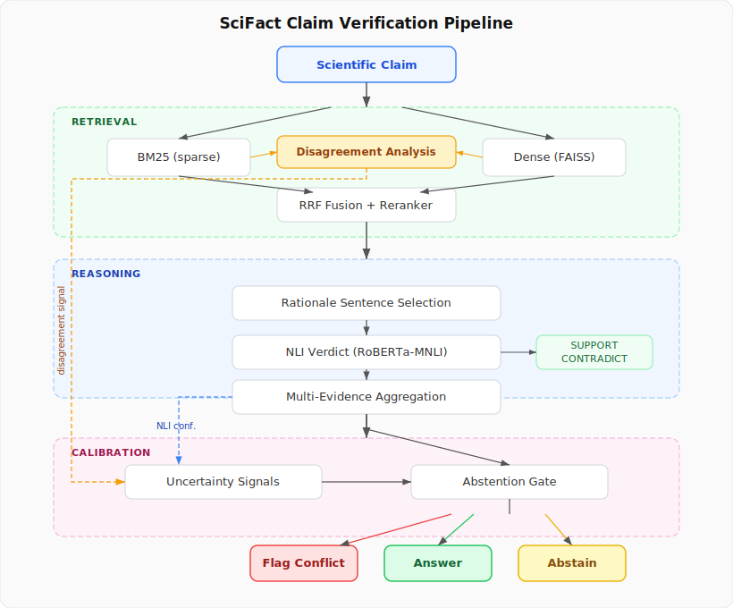

# SciFact Claim Verification

A scientific claim verification system built on hybrid retrieval-augmented generation. Given a claim like *"Aspirin reduces the risk of colorectal cancer"*, the system retrieves relevant research abstracts, selects rationale sentences, predicts a verdict (SUPPORT / CONTRADICT / NOT ENOUGH EVIDENCE), and generates a short cited explanation.

**Research angle:** We use the disagreement between sparse (BM25) and dense retrieval as a first-class uncertainty signal for calibrated abstention. When the two retrievers disagree on what's relevant, the system knows it should be less confident.

Built for the RAG course at the University of Zurich, FS 2026.

## Architecture

<p align="center">
  
</p>

## Results

### Retrieval Ablation (SciFact Dev, 300 queries)

| Condition | nDCG@10 | Recall@5 | Recall@10 | MRR |
|-----------|---------|----------|-----------|-----|
| BM25 only | 0.830 | 0.878 | 0.941 | 0.797 |
| Dense only (MiniLM-L6) | 0.774 | 0.869 | 0.912 | 0.731 |
| **Hybrid (RRF)** | **0.850** | **0.905** | **0.950** | **0.824** |

### Retriever Disagreement Analysis (SciFact Dev, 188 queries with relevance judgments)

| Metric | Value |
|--------|-------|
| Mean Jaccard@10 (BM25 vs. dense top-10 overlap) | 0.224 |
| Top-1 agreement rate | 51.3% |
| Retrieval success — high agreement group | 99.0% |
| Retrieval success — high disagreement group | 94.4% |
| **Success gap (agreement - disagreement)** | **+4.5%** |
| Pearson(Jaccard, retrieval success) | 0.135 |

When retrievers agree, retrieval almost always succeeds (99%). When they disagree, success drops and 11% of cases have only one retriever finding the relevant document.

### Verdict Prediction (SciFact Dev, per-document NLI)

Pipeline: hybrid retrieval (top-5) -> full abstract -> DeBERTa-v3-large-mnli-fever-anli-ling-wanli (zero-shot).

| Metric | Value |
|--------|-------|
| Accuracy | 0.260 |
| Macro-F1 | 0.245 |
| SUPPORT P / R / F1 | 0.663 / 0.292 / 0.405 |
| CONTRADICT P / R / F1 | 0.862 / 0.205 / 0.331 |

Zero-shot NLI still struggles with scientific claims — the model defaults to "neutral" for domain-specific evidence. Retrieval recall is strong (87.1% of gold docs found), but the NLI model is the bottleneck. Fine-tuning on SciFact training data would significantly improve verdict accuracy.

### Abstention (SciFact Dev)

| Metric | No Abstention | With Abstention |
|--------|---------------|-----------------|
| Accuracy | 0.260 | 0.210 |
| Macro-F1 | 0.245 | 0.207 |
| Coverage | 100% | 74.6% |

| Gate Decision | Count |
|---------------|-------|
| Answered | 143 |
| Abstained | 45 |
| Flagged (conflict) | 0 |

The abstention gate identifies uncertain claims (24% abstention rate) using NLI confidence, retriever disagreement, and evidence conflict signals. The AUC of the coverage-risk curve is 0.119 — improving the underlying NLI model would unlock stronger abstention gains.

## Setup

```bash
git clone https://github.com/Kai3421/scifact-claim-verification.git
cd scifact-claim-verification
pip install -e ".[dev]"

# Download SciFact data
mkdir -p data/raw && cd data/raw
wget https://scifact.s3-us-west-2.amazonaws.com/release/latest/data.tar.gz
tar -xzf data.tar.gz
cd ../..
```

## Usage

```bash
# BM25 baseline
python scripts/01_baseline_retrieval.py

# Dense + hybrid ablation
python scripts/02_dense_retrieval.py
python scripts/02_dense_retrieval.py --model intfloat/e5-base-v2

# Retriever disagreement analysis
python scripts/03_disagreement_analysis.py
python scripts/03_disagreement_analysis.py --k 5

# Evidence selection + verdict prediction
python scripts/04_evidence_verdict.py
python scripts/04_evidence_verdict.py --mode bm25
python scripts/04_evidence_verdict.py --nli-model roberta-large-mnli --top-k 10

# Abstention evaluation
python scripts/05_abstention.py
python scripts/05_abstention.py --threshold 0.35
python scripts/05_abstention.py --mode bm25 --no-conflict-override

# Claim decomposition analysis
python scripts/06_claim_decomposition.py

# Explanation generation
python scripts/08_generation.py
python scripts/08_generation.py --method template

# Leaderboard predictions (AllenAI SciFact format)
python scripts/09_leaderboard_predictions.py --split dev
python scripts/09_leaderboard_predictions.py --split test --nli-model models/verdict-scifact

# Run tests
pytest tests/ -v
```

## Project Structure

```
src/claimverify/
    data/           SciFact corpus loader
    retrieval/      BM25, dense (FAISS), RRF fusion, reranker, disagreement analysis
    reasoning/      Rationale selection, NLI verdict prediction, multi-evidence aggregation
    calibration/    Uncertainty signals, abstention gate, threshold tuning
    preprocessing/  Claim decomposition for compound claims
    evaluation/     Retrieval metrics, verdict metrics, citation fidelity, leaderboard formatter
    generation/     Cited explanation generation (template + extractive)
scripts/            Evaluation scripts
configs/            Hydra configuration
tests/              Unit tests (88 total)
results/            Evaluation outputs (JSON)
docs/               Architecture diagram
```

## Dataset

[SciFact](https://github.com/allenai/scifact) (Wadden et al., EMNLP 2020): 1,409 claims against 5,183 research abstracts with sentence-level evidence annotations.

## References

- Wadden et al., *Fact or Fiction: Verifying Scientific Claims* (EMNLP 2020)
- Wadden et al., *MultiVerS* (Findings of NAACL 2022)
- Thakur et al., *BEIR: A Heterogeneous Benchmark for Zero-shot Evaluation of IR Models* (NeurIPS 2021)
- Cormack et al., *Reciprocal Rank Fusion* (SIGIR 2009)
- Asai et al., *Self-RAG: Learning to Retrieve, Generate, and Critique* (ICLR 2024)
- Atanasova et al., *Fact Checking with Insufficient Evidence* (TACL 2022)
